# Artemis 原产品架构总览（Legacy Architecture Overview）

版本: 2.5    更新时间: 2026-10-08

> 调研对象：原仓库 `~/Projects/mydotey/artemis`（version 2.0.2，git HEAD 9727bb5）。
> 定位：**事实层 · 架构视图入口**。本文给出架构风格判定、部署全景、**视图地图**（各视图的归属）、**机制索引**（按机制查域文档编号）与**关键架构约束清单**；各视图的详细描述见 [arch/](arch/README.md)，判断层结论（可继承资产 / 局限）见[基线](legacy-product-analysis.md) §5/§6。
> 本文只做架构级综合，不重复取证：所有判定的可执行证据在视图文档与被引文档中，引用格式为原仓库根相对路径 + 行号（注明「原仓库」）。
> 阅读顺序建议：本文 → [arch/decisions.md](arch/decisions.md)（为什么这样设计）→ 各视图文档 → 对应业务域文档。

---

## 1. 架构风格判定

一句话定位：**AP 型服务注册中心**——对等节点全对全异步复制 + 租约心跳（「心跳即注册」）+ Eureka 式自我保护 + 静态集群成员；数据面（注册表，纯内存）与管理面（DB 持久化流量治理元数据）双轨分离。

把这句话拆成可比较的坐标轴（每条的证据在「详见」列）：

| 维度 | 判定 | 详见 |
|---|---|---|
| 一致性取舍 | **AP**：无 quorum、无 leader、覆盖写 + 多路收敛，最终一致 | [decisions](arch/decisions.md) D1；replication-cluster-logic L1–L4 |
| 集群拓扑 | **对等全对全**：region 内每节点互为全量副本，扇出 N−1 | [structure](arch/structure.md)；replication-cluster-logic L1 |
| 成员管理 | **静态**：成员表来自配置，无共识协议、无自举机制 | [decisions](arch/decisions.md) D5；replication-cluster-logic L5 |
| 事实源模型 | **客户端持有事实源**（本地实例集），服务端注册表是其投影 | registry-lease-logic L1–L3 |
| 时效机制 | **租约 + 心跳**：心跳即注册，续约即保活，TTL 过期即摘除 | registry-lease-logic L2–L6 |
| 平面分离 | **数据面 / 管理面双轨**：内存 vs DB，正交，管理面可整体关闭 | [structure](arch/structure.md)；[decisions](arch/decisions.md) D4 |
| 客户端模型 | **Smart client**：嵌入式 SDK 自带本地缓存、三级地址容灾、熔断换址 | client-sdk-logic L1–L4 |
| 接入模型 | **推送为主 + 兜底轮询**：WS 订阅增量，60s 三层兜底全量 | discovery-logic L3–L4 |
| 部署形态 | **模块化单体**：Maven 分层严格单向，运行时是单个 Spring Boot 进程 | [structure](arch/structure.md) |
| 通信协议 | **三通道并存**：同步 HTTP/JSON（REST）+ 长连接 WS（心跳 / 推送）+ 异步 HTTP（复制） | [runtime](arch/runtime.md) |
| 扩展模型 | **region 隔离，非分片**——region 是边界不是分片键，单 region 写容量不可水平切分 | [decisions](arch/decisions.md) D1；基线 §6.4 |
| 安全模型 | **信任内网**：无鉴权、无 TLS，region/zone 仅作软隔离 | [quality](arch/quality.md)；product-overview §3.5 |

## 2. 整体架构与部署全景

本图是架构图集的**入口图**：除部署全景外，虚线框表达**双轨分离**（数据面 KERNEL + peer 副本纯内存、零 DB；管理面 MGMT + DB 可整体关闭，约束 C8 / 决策 D4），SDK 盒标注客户端两大能力（缓存永不失效 C4、三级地址容灾），peer 区标注 region / zone 语义（C1 / C2）。图中每个盒子都是通往细节图的门——机制怎么动见 [runtime](arch/runtime.md) §7 的场景时序图，数据归谁见 [structure](arch/structure.md) §4.1 的所有权图。

图源 `arch/diagrams/overview-architecture.html`；模块内部组件清单与生命周期见 [structure](arch/structure.md) §2，复制通道的批量参数与线程预算见 [runtime](arch/runtime.md) §1–§2，region/zone 拓扑的部署语义见 [deployment](arch/deployment.md) §2。

接入层对内只有一层协议转换：Controller/Handler 反序列化后直调内核单例（如 `HeartbeatWsHandler.handleTextMessage` → `RegistryServiceImpl.heartbeat`，`artemis-server/.../websocket/HeartbeatWsHandler.java`，原仓库）。Spring 只存在于接入层与装配层。

## 3. 视图地图

架构描述按视图组织；下表是各视图的归属与状态。「备注」列标注该视图内的**未闭合项**——这些是重设计的输入缺口，不是「原产品没有」。

| 视图 | 回答什么 | 归属 | 状态 | 备注 |
|---|---|---|---|---|
| 上下文 | 系统边界、外部参与者与依赖、明确不做什么 | [structure](arch/structure.md) §1 | 已建 | |
| 组件 / 逻辑 | 运行期组件清单、各自职责与对外接口、依赖方向、分层约束 | [structure](arch/structure.md) §2–§3 | 已建 | 包级存在环 `cluster ↔ registry.replication` |
| 数据 | 实体、事实源与所有权、存储、生命周期、一致性模型总表 | [structure](arch/structure.md) §4 | 已建 | 配图：[数据所有权图](arch/diagrams/structure-data-ownership.svg)；字段级见 [data-model](domains/data-model.md)、表结构见 [db-schema](domains/db-schema.md) |
| 运行时 / 并发 | 进程与线程、并发控制、通信模式、背压与队列 | [runtime](arch/runtime.md) §1–§2 | 已建 | |
| 生命周期 / 状态 | 启动序列与 readiness 门控、运行期状态机、关闭与重启、故障降级 | [runtime](arch/runtime.md) §3–§5 | 已建 | 关停路径**缺失**（无优雅停机） |
| 接口 / 协议 | 三通道的架构分工、协议选型评价、版本与兼容 | [runtime](arch/runtime.md) §6 | 已建 | 报文见 [api-contract](domains/api-contract.md)、[client-sdk-api](domains/client-sdk-api.md) |
| 场景 / 时序 | 核心机制**怎么动**：注册心跳、发现推送、复制扇出、失联剔除的端到端时序（4 张 sequence 图） | [runtime](arch/runtime.md) §7 | 已建 | |
| 部署 / 拓扑 | 部署单元与打包形态、region/zone 拓扑、集群成员、配置体系架构 | [deployment](arch/deployment.md) | 已建 | 生产是否前置 LB 未证实 |
| 横切关注点 | 错误处理与错误码、配置、安全、可观测性、限流 | [quality](arch/quality.md) §1–§4；配置见 [deployment](arch/deployment.md) §4 | 已建 | |
| 质量属性 / 容量 | 性能、可用性、可扩展性的**定量模型**（内存 / 带宽 / 写放大 / 上限估算） | [quality](arch/quality.md) §5 | 已建 | 模型为**推导**，未实测校准 |
| 决策与权衡 | 决策 → 背景 → 备选 → 理由 → 代价；敏感点与风险 | [decisions](arch/decisions.md) | 已建 | 11 条决策；备选与代价属推断 |
| 工程与构建 | 技术栈与版本、依赖管理、构建产物、测试策略与空白 | [structure](arch/structure.md) §5 | 已建 | 核心机制零自动化测试 |
| 演化与兼容 | 版本策略、历史包袱、迁移路径 | [quality](arch/quality.md) §6 | 已建 | **无迁移路径** |

**与规格层文档的分工**：本文与视图文档回答「结构上是什么样、为什么这样」；业务域文档（[domains/](domains/README.md)）回答「怎么运转、什么行为」；契约制品回答「长什么样（字段 / 报文 / 表）」。同一事实不在两处重复取证——架构文档引用域文档的 L/D/F 编号，不复制其结论。

## 4. 机制索引

视图地图（§3）按**视图**导航；本表按**机制**导航——想知道「心跳模型在哪」，查这里。编号为各域逻辑蓝本的 L（逻辑单元）/ D（决策规则）/ F（流程）编号，均已对域文档核实。行为细节一律以域文档为准，本表只做定位。

| 机制 / 数据流 | 要点（一句话） | 详见 | 配图 |
|---|---|---|---|
| 心跳即注册与租约模型 | 本地实例集唯一事实源；心跳全量上报 = 注册 + 续约；双租约池（20s / 90s） | registry-lease L1–L5、D1、F1–F2 | [注册与心跳](arch/diagrams/scenario-register-heartbeat.svg) |
| 过期清理与自我保护 | clean 摘除决策；safe-checker 窗口阈值；显式 evict 绕过保护 | registry-lease L6–L8、D2 / D4 / D7、F3 | [失联剔除](arch/diagrams/scenario-expiry-selfprotection.svg) |
| 对等全对全异步复制 | 双通道去重合并；TTL 尽力送达；扇出按状态门控；失败定向重试 | replication-cluster L1–L4、D1–D3、F1–F2 | [复制扇出](arch/diagrams/scenario-replication-fanout.svg) |
| 集群成员与节点状态 | 静态拓扑（配置驱动）；5s 串行自声明探测；force 优先级矩阵 | replication-cluster L5–L6、D4–D5、F4 | [节点状态机](arch/diagrams/runtime-node-state.svg) |
| 启动门控与冷启动 | 双目标 readiness；peer 全量拉取重建；空集群死锁缺陷 | replication-cluster L7、F3；[runtime](arch/runtime.md) §3 | [启动门控](arch/diagrams/runtime-startup-gate.svg) |
| 推送通知 | 跳表消费 → 过滤 → 会话同步发送；at-most-once | discovery L3–L4、D3、F2 / F5 | [发现与订阅](arch/diagrams/scenario-discovery-subscribe.svg) |
| 版本化缓存与增量 | 30s × 3 份快照；delta 设计完整但客户端未消费 | discovery L2、F4；discovery-spec FR-DIS-10 | — |
| 发现过滤器链 SPI | Group → Management；逐 filter 容错（fail-open） | discovery L1、D4；traffic-governance L1–L2 | — |
| 四级摘除与生效 | instance → server → zone → group 级联；操作记录即状态；合成事件复用推送管线 | operations-audit L1–L4、D1–D2、F1–F3 | — |
| 两段式灰度与 canary | 未发布权重 → release 才生效；canary 自动建专属规则组 | traffic-governance L4–L5、F1–F2 | — |
| 注册 / 心跳端到端 | 首次注册 ≈6s 可见；稳态心跳 + 复制扇出 | registry-lease F1–F2；[quality](arch/quality.md) §5.5 | [注册与心跳](arch/diagrams/scenario-register-heartbeat.svg) |
| 发现端到端 | 首次 lookup + 订阅；增量落地；三层兜底 | discovery F1、F4–F5 | [发现与订阅](arch/diagrams/scenario-discovery-subscribe.svg) |
| 客户端寻址容灾 | 引导地址 → 存活列表 → 随机选址，配熔断与 TTL 轮换 | client-sdk L3–L4、D1–D2、F2–F3 | — |

## 5. 关键架构约束清单

以下约束是原架构的**不变量**：新设计若要在某个维度上偏离，必须先明确它推翻的是哪一条。编号供 [decisions](arch/decisions.md) 与重设计文档引用。

约束清单是**编号引用**（C1–C10），与章节号无关；本文新增小节不会改变任何 C 编号。

| # | 约束 | 说明 |
|---|---|---|
| C1 | region 是集群边界 | region 间零同步；多 region = 多独立集群，无跨 region 协调 |
| C2 | zone 是写入准入单位 | 默认仅同 zone 可注册 / 可发现；**非数据局部性单位**（复制仍 region 全量） |
| C3 | 数据面零持久化 | 注册表纯内存，重启即空，靠客户端重注册与 peer 全量拉取重建 |
| C4 | 客户端缓存永不失效 | 服务端全挂时继续返回最后快照，以陈旧换可用；无磁盘快照 |
| C5 | 集群成员静态 | 成员表来自配置，无自举、无动态加入 / 退出 |
| C6 | 服务端不做健康探测 | `healthCheckUrl` 仅透传，实例状态由客户端自报 |
| C7 | 单 region 单写域 | 无分片，写容量随节点数下降（全对全写放大） |
| C8 | 数据面组件不依赖 DB | 只有管理面读 DB；`artemis.management.enabled=false` 时零外部依赖 |
| C9 | 内核零 Spring、模块依赖单向无环（**模块级**） | 依赖是**偏序而非链**：`server` 同时直连 `service` 与 `management`（勘误 #21）。⚠ 包级另有 `cluster ⇄ registry.replication` 一处环，见 [structure](arch/structure.md) §3.1。客户端运行时仅依赖 common |
| C10 | 开源形态无安全屏障 | 全 API 无鉴权、明文 http/ws、DB 明文密码；仅 WS IP 黑名单 + region/zone 软隔离 |

## 更新历史

| 版本 | 日期 | 变更说明 |
| ------ | ------ | ------ |
| 2.5 | 2026-10-08 | §2 改题「整体架构与部署全景」（图补双轨分离 / 客户端能力 / region-zone 语义三个论点）；新增 5 张图——4 张场景时序入 [runtime](arch/runtime.md) §7、数据所有权入 [structure](arch/structure.md) §4.1；§4 机制索引新增「配图」列、§3 数据视图备注配图；§3 视图地图补「场景 / 时序」行 |
| 2.4 | 2026-10-08 | 新增 §4 机制索引（按机制查域文档 L/D/F 编号），原 §4 约束清单顺延为 §5；C 编号不变 |
| 2.3 | 2026-10-08 | §4 C9 补明「模块级偏序非链」并指向包级环；勘误指针同步 |
| 2.2 | 2026-10-08 | §2 部署全景的 ASCII 盒图改为架构图（[diagrams/](arch/diagrams/README.md)），细节交由各视图文档 |
| 2.1 | 2026-10-08 | 视图地图补状态与未闭合项（5 份视图文档已落盘） |
| 2.0 | 2026-10-08 | 拆分为架构视图文档集：本文改为总览与视图地图入口，原 §2–§7 迁入 [arch/](arch/README.md) |
| 1.1 | 2026-10-08 | 按规格层重整：机制叙事改为索引 |
| 1.0 | 2026-10-07 | 初版 |
