# 原产品运行时视图（Runtime View）

版本: 1.3    更新时间: 2026-10-08

> 调研对象：原仓库 `~/Projects/mydotey/artemis`（version 2.0.2，git HEAD 9727bb5）。
> 定位：**事实层 · 架构视图——动态行为**。回答进程与线程模型（§1）、并发控制与背压（§2）、启动序列与就绪门控（§3）、运行期状态机（§4）、关闭与重启（§5）、三通道接口分工（§6）、核心场景端到端时序（§7）。总览入口 [../arch.md](../arch.md)。
> 边界：跨域端到端流程（含失败路径的时序叙事）见 [domains/](../domains/README.md) 各域 logic 的 F 系列；报文契约见 [api-contract](../domains/api-contract.md)、[client-sdk-api](../domains/client-sdk-api.md)。本文写**结构性的运行时形态**（线程、队列、状态、生命周期），不重复流程叙事。
> 证据引用为相对原仓库根路径（注明「原仓库」）。

---

## 1. 进程与线程模型

### 1.1 进程模型

| 部分 | 进程 | 线程组来源 |
|---|---|---|
| 服务端 | 单个 JVM（内嵌 Tomcat），接入 + 内核 + 管理面**同进程** | Tomcat worker 池 + 全部后台线程 |
| 客户端 SDK | 宿主 JVM 内（嵌入库） | 每 manager 一套线程树 |

**结构性后果**：服务端所有后台线程与 Tomcat worker 共享同一 JVM 资源池；管理面刷新线程与数据面推送线程竞争同一 CPU——管理面（或复制）线程饥饿会直接吃掉请求处理能力。

### 1.2 服务端后台线程清单

| 线程（组） | 数量 | 周期 / 触发 | 归属 |
|---|---|---|---|
| lease-manager clean | 2 × 2 = 4 | 1s | 两个 `LeaseManager`（普通池 + legacy 池） |
| lease-update-safe-checker | 2 | 1s | 每 `LeaseManager` 一条 |
| service-cluster 探测 | 1 | 5s `scheduleWithFixedDelay`（**串行**） | `ClusterManager` |
| NodeManager init 门控循环 | 1（daemon） | 1s（UP 即 return 退出） | `NodeManager` |
| notification-worker | 10（daemon） | 阻塞消费变更跳表（空则 20ms 自旋） | `NotificationCenter` |
| versioned-cache 刷新 | 1 | 60s 首刷 / 30s | `VersionedCacheManager` |
| 复制 acceptor | 2（daemon，批 / 非批各 1） | 5ms 写等待循环 | 两个 `TaskAcceptor` |
| 复制 executor | 2 × 20 = 40（daemon） | 阻塞取 workQueue | 两个 `TaskExecutor` |
| WS session health-checker | 3（每 Handler 1） | 默认 60s | `ArtemisWsHandler` 基类 |
| 管理面 cache-refresher | 3 | Group / Zone 5s、Management 1s | 三 Repository |

**合计常驻后台线程 ≈ 67（未计 Tomcat worker）**，其中复制子系统占 42——线程预算大头在复制，与全对全扇出的负载形态匹配。

> ⚠ 复制线程数配置**不生效**：`artemis.properties` 的键写成 `artemis.service.registry.replicaton.*`（少一个 `i`），与代码 dispatcherId `...replication.*` 不匹配，因此发布的 thread-count / 攒批延迟设置被忽略，**实际取代码默认 20 / 2s**（[config-reference](../domains/config-reference.md) §7.1 死键，本次以线程清单复核）。

### 1.3 客户端线程清单（每 manager）

| 线程 | 归属 | 周期 |
|---|---|---|
| address-repository ×2 | registry / discovery 各一条（⚠ **同名**，线程 dump 无法区分） | 5min 列表刷新 |
| websocket-session.health-check ×2 | 两套 `WebSocketSessionContext` | 1s |
| instance-registry.heartbeat-checker ×1 | `InstanceRegistry` | 1s |
| service-discovery poller ×1 | `ServiceDiscovery` | 60s 兜底 |
| serviceChangeCallback ×1 | 单线程 `ExecutorService` | 事件驱动 |

⚠ 回调 executor 线程为 **non-daemon 且无 shutdown**——阻止 JVM 退出（[client-sdk-logic](../domains/client-sdk-logic.md) §7.1）。

## 2. 并发控制与背压

### 2.1 锁策略与并发手法

| 手法 | 使用点 | 说明 |
|---|---|---|
| **Lease 级 tryLock** | renew 与 clean 竞争 | 非阻塞互斥，抢不到即跳过（不排队） |
| **volatile 整体换新**（copy-on-swap） | 节点视图、管理面缓存、`DiscoveryFilters._filters`、版本化快照 | 读路径无锁 |
| **两级 CHM 直读** | 注册表 `_services` / `_leases` | 读路径近无锁；`getService` 组装时 clone 外壳（⚠ Instance 元素引用共享） |
| **写入无事务** | register 三步非原子 | 靠幂等覆盖 + `creationTime` 新旧保护收敛 |
| **CAS 幂等守卫** | `ClusterManager._inited`、`ManagementInitializer._started`、`WebSocketSessionContext._isChecking` | 防重复初始化 / 防重入 |
| **同步块** | `ServiceRepository` 缓存更新、WS `session.sendMessage` | ⚠ 见 §2.3 已知弱点 |

### 2.2 队列与背压

| 队列 | 类型 | 容量 | 满时行为 |
|---|---|---|---|
| 复制 workQueue | `LinkedBlockingQueue` | **无界**（配 `max-buffer-size` 逻辑阈值 10000） | 单条通道：丢**队头最旧**一条 + warn；⚠ 批量通道**保护实际不触发**（见下），workQueue 可无界增长 |
| 变更跳表 `_instanceChangeSet` | `ConcurrentSkipListSet`（按 changeTime 升序） | 逻辑阈值 **10000** | `pollFirst()` 丢**最早**一条 + warn |
| 通知 worker | — | 10 线程**同步**发送 | 无队列——慢订阅者阻塞 worker |
| WS 文本缓冲（客户端） | 容器级 incoming 上限 | 默认 **8KB**（范围 8–32KB） | 容器关闭会话 → 客户端走重连（非静默丢弃） |

参数：复制批量 250 条 / 攒批延迟 2s / acceptor 写等待 5ms / executor 线程 20；任务 TTL **5s（自首次提交起算）**，出队时过期即丢——刻意设计，一致性靠下一轮心跳收敛。变更跳表空时 worker 20ms 自旋。

> ⚠ **新发现：批量通道的缓冲保护失效**。`BatchingTaskAcceptor` 自带一个 `_pendingTaskCount` 字段，**遮蔽**了父类 `TaskAcceptor` 的同名字段；子类 `assignWork` 只增 / 减自己的计数器，而父类 `pollWork` 递减、`isBufferFull()` 读取的都是**父类**计数器。结果：批量通道的父类计数只被减、从不被加，`buffer-full-dropped` 保护在批量通道（即**心跳复制通道**）上**实际不触发**。单条通道无此遮蔽，行为正常。已登记至 [product-overview](../product-overview.md) §6。

### 2.3 已知并发弱点

| 弱点 | 后果 |
|---|---|
| `NotificationCenter` **同步发送**，无 per-subscriber 队列 | 慢消费者占住 worker；10 worker 占满后整条推送管线停滞 |
| `NotificationCenter._filters` 为 CHM（无确定顺序） | 单元素时无影响，多 filter 时顺序不可控 |
| `ClusterManager._nodeStatusMap` 非 volatile 整体换新 | benign race，读方可能短暂看到旧视图 |
| 客户端回调单线程**无界队列** | 慢消费者堆积（含整服务克隆），OOM 风险 + 全局变更延迟 |
| `ServiceRepository` 单锁 | 串行化三热点（缓存写 / 读 / 推送落地） |
| WS 心跳解析异常**回固定 success** | 错误被吞掉，客户端不感知（[product-overview](../product-overview.md) §6） |

## 3. 启动序列与就绪门控

### 3.1 服务端启动时序

```text
App.main
 └─ ArtemisServer.INSTANCE.init()                        ← 先于 Spring 启动
     ├─ [management.enabled=true]  ManagementInitializer.init()
     │     └─ DataConfig.init() → GroupRepository.init() → ZoneRepository.init()
     │        → ManagementRepository.init() → 注册 filter/订阅
     │        → NodeManager.registerInitializer(this)     ← 参与启动门控
     └─ ClusterManager.INSTANCE.init()
           ├─ 校验 regionId / zoneId 非空（否则抛错）
           ├─ 构造 ServiceCluster（读静态成员配置）→ updateNodesCache()
           ├─ 启动 5s 探测线程
           └─ NodeManager.INSTANCE.init()
                 ├─ status = STARTING
                 ├─ 注册 8 个 force / zone 属性变更监听
                 ├─ 注册 RegistryReplicationInitializer
                 └─ 启动 daemon 门控循环（1s 周期）     ← 异步，不阻塞启动
 └─ SpringApplication.run                                 ← 接入层 bean 在这之后
     └─ WebSocketEndpointConfig：3 个 Handler.start()（各起 health-checker）
        并把 2 个订阅者注册进 NotificationCenter
```

两个结构性事实：

1. **数据面启动先于接入层**——`ArtemisServer.init()` 在 `SpringApplication.run` 之前，内核的失败会阻止进程进入 Spring 启动（抛 `IllegalStateException("Artemis server init failed!")`）。
2. **门控循环是异步的**——启动线程不等它，进程可服务（`/api/status/*` 等无门控端点）但注册 / 发现被拒，直到 `status = UP`。

### 3.2 readiness 门控链路



就绪判定 = `NodeManager._nodeStatus.status == UP`，需**两个目标**同时达成：

| 目标 | 注册者 | 达成条件 |
|---|---|---|
| **REGISTRY** | `RegistryReplicationInitializer` | 从任一 UP peer 全量拉取 `services.json` 并重建租约，且 `replicationInstanceCount > 0` |
| **DISCOVERY** | `ManagementInitializer` | `ManagementRepository.isLastRefreshSuccess() && GroupRepository.isLastRefreshSuccess()` |

⚠ **`ZoneRepository` 不参与 DISCOVERY 门控**——虽然它在启动时被 `init()`，但其刷新成功与否不影响就绪判定。既有文档未点破此点。

未就绪时的拒绝口径（均返回 `service-unavailable`）：

| 入口 | 判定 | 是否门控 |
|---|---|---|
| registry 写（register / unregister / heartbeat） | `RegistryTool.checkRegistryStatus(false)` | ✓ |
| discovery 读（lookup / getService(s) / delta） | `DiscoveryServiceImpl.checkDiscoveryStatus()` | ✓ |
| management 写（operate* / group / zone / canary） | `ServiceNodeUtil.checkCurrentNode`（用 `isUp`） | ✓ |
| `/api/status/*`、`/api/cluster/*` | — | ✗（排障面，刻意不门控） |
| `/api/replication/registry/*` | `checkRegistryStatus(true)` | ✗（复制豁免，否则无法自举） |

### 3.3 空集群死锁

无 peer 可拉时 `RegistryReplicationInitializer.initialized()` 恒 `false`；即便拉到 peer，若该 peer **无实例**，仍返回 `false`（判据是 `replicationInstanceCount > 0`）。因此 REGISTRY 目标永不为真 → `status` 永不 UP → 门控循环永久空转在 STARTING。**空集群无法自举**（[replication-cluster-logic](../domains/replication-cluster-logic.md) §7.3）。

### 3.4 force-up 旁路

`artemis.service.cluster.node.status.force-up=true` 直接把 `status / canServiceRegistry / canServiceDiscovery` 置真并 warn——**两个目标全部跳过**（peer 全量拉取 + 管理面首刷等待）。样例配置即此形态（`artemis-package/src/main/resources/artemis.properties`，原仓库）。边界：本机 IP 粒度的 `force-down` 覆盖 `force-up`。

## 4. 运行期状态机

### 4.1 节点状态



取值：`STARTING` / `UP` / `DOWN` / `UNKNOWN`，另有 4 个平面布尔位（`canServiceRegistry` / `canServiceDiscovery` / `allowRegistryFromOtherZone` / `allowDiscoveryFromOtherZone`），全部 volatile。

| 从 | 事件 | 到 | 备注 |
|---|---|---|---|
| STARTING | 两目标均达成 | UP | 门控循环 1s 周期 |
| STARTING | `force-up=true` | UP | 跳过初始同步 |
| 任意 | `force-down.<本机ip>=true` | DOWN | 覆盖 force-up |
| UP / DOWN | — | 不迁移 | ⚠ **UP 后无回退**；`force-down` 撤销后**保持 DOWN（粘性）**，需 force-up 或重启 |

**存放**：纯内存（本机在 `NodeManager._nodeStatus`，集群视图在 `ClusterManager._nodeStatusMap`），**无任何持久化**。集群视图由 5s 周期的串行探测维护（POST peer `/api/status/node.json`，3 次重试，远端不可达立即 break）。

⚠ 自声明探测**未设 socket timeout**（对比同类的 `getClusterStatus` 设了超时；200ms 属性名与实际用途不符）——探测调用依赖 HTTP 客户端默认值（[replication-cluster-logic](../domains/replication-cluster-logic.md) §7.9 复核并细化）。

### 4.2 租约状态

`Lease` **无独立状态字段**，状态由派生量表达：`_creationTime`（final 语义）、`_renewalTime`（volatile）、`_evictionTime`（volatile）、`_isExpired`（volatile 缓存位）、`ttl()`（运行期动态读配置）。

| 事件 | 判定 | 动作 |
|---|---|---|
| 新建 | `LeaseManager.register` | 入池 |
| 续约 | `tryLock` 成功且未过期 | 刷新 `_renewalTime`，`markUpdate()` |
| 过期 | `now > renewalTime + ttl` 或已被 evict | `_isExpired = true` |
| 显式摘除 | `evict()` | 只设一次 `_evictionTime = now` |
| 保护态跳过 | clean 中未显式 evict 且 `!isSafe()` | `continue`，不清理 |
| clean 竞态 | `creationTime` 更新者胜出 | 回填新租约 |

**双租约池**：普通池 TTL 20s / legacy 池 TTL 90s，分流判据是 `instance.metadata["java_registry"]` 非空（兼容老客户端）。

### 4.3 摘除态（四级）

**存储形态是 DB 操作记录行，不是数据面状态字段**；数据面读内存缓存映射（无记录 ⇒ 未摘除）。四级级联判定顺序：instance → server → zone → group，任一命中即 down。

⚠ **判定只看行是否存在，与 operation 取值无关**——`"up"` / `"down"` 不参与判定。因此恢复**只能靠删除记录行**，无法用一条反向记录抵消。摘除态与租约态正交（[product-overview](../product-overview.md) §3.3）。

### 4.4 客户端状态

| 状态机 | 取值与迁移 |
|---|---|
| **WS 会话** | CONNECTING（握手异步 + 5s 超时）→ ACTIVE → CLOSED（TTL 5min / ping 超时 / 对端关闭 / 主动 markdown）→（重连限流通过）→ CONNECTING。重连限流 5 次 / 20s，超限仅记日志放弃 |
| **地址上下文** | ACTIVE → INVALID（`markUnavailable` CAS，仅作废本上下文）/ EXPIRED（1h TTL）→ 下次取用重选 |
| **心跳判定** | `now − lastHeartbeatTime ≥ ttl(20s)` → `markdown()` 触发换址；`≥ interval(5s)` → 重发 |
| **补注册** | 心跳响应携带 `failedInstances`，`errorCode ∈ {DATA_NOT_FOUND, UNKNOWN}` 的实例走 HTTP 补注册 |

细节见 [client-sdk-logic](../domains/client-sdk-logic.md) §3、§4 D3、§5 F4。

## 5. 关闭与重启

### 5.1 服务端：无优雅停机

| 检查 | 结果 |
|---|---|
| `addShutdownHook` / `@PreDestroy` / `DisposableBean` / `ContextClosedEvent` | **全仓库 0 命中** |
| `server.shutdown` / `spring.lifecycle.*` 配置 | **无** |
| 复制子系统 `shutdown()` | 方法存在（`TaskAcceptor` / `TaskExecutor` / `DefaultTaskDispatcher`），**无生产调用者** |

**后果**：所有 acceptor / executor / 刷新线程均为 daemon；JVM 退出时落在复制队列中的在途任务（TTL 5s）**直接丢失**，不排空、不落盘。一致性靠对端心跳自愈兜底。

### 5.2 客户端：无关闭 API

`ArtemisClientManager` 只有 getter 与静态 `getManager`；`RegistryClient` / `DiscoveryClient` 接口**无 close / shutdown**；`WebSocketSessionContext.shutdown()` 是无调用者的死代码。叠加回调线程 non-daemon 且无 shutdown——**SDK 会阻止宿主 JVM 退出**。无状态查询 API，宿主无法感知 SDK 是否可用。

### 5.3 重启恢复路径

```text
重启 → status = STARTING → 门控循环
        └─ RegistryReplicationInitializer.initialized()
              └─ 逐 peer（先本 zone，后其他 zone）找 UP 节点
                    └─ POST /api/replication/registry/services.json（超时 2s）
                          └─ 逐 service 走复制接收接口重建本地租约
                                └─ 成功判据：replicationInstanceCount > 0
```

**数据面零持久化的证据**：`RegistryRepository` 仅持有内存结构（`_services` / 两级 `_leases` / `_instanceChangeSet` + 两个 `LeaseManager`）；在内核与接入层 grep 任何文件写入 API **零命中**；唯一落盘在管理面 DB（治理元数据，非注册数据）。因此**全集群同时重启无 DB 可救**，依赖客户端风暴式重注册（心跳天然摊批）。

## 6. 接口与协议：三通道分工

### 6.1 通道全景

| 通道 | 协议 | 方向 | 语义 | 用途 |
|---|---|---|---|---|
| **REST** | HTTP/JSON，同步 request-response | 客户端 → 服务端；管理面 → 服务端 | 有响应、有错误码 | 注册补报、发现查询、集群查询、状态查询、管理运维（77 端点） |
| **WS 心跳** | WebSocket，长连接 | 客户端 → 服务端（双向） | 高频小报文，响应携带 `failedInstances` | **心跳即注册**（5s 全量上报）+ 补注册指令下发 |
| **WS 推送** | WebSocket，长连接 | 服务端 → 客户端 | 单向增量 | 订阅式变更推送（2 个端点：单服务订阅 / 全服务广播） |
| **复制** | HTTP/JSON，异步单向 | peer → peer | 无调用方等待 | 3 种消息（register / unregister / heartbeat）对等扇出 |

三条通道不共享连接、不共享序列化配置、不共享重试策略——是**三套独立的传输实现**。

### 6.2 协议选型评价

| 选型 | 代价 |
|---|---|
| WS + JSON 文本（非二进制 / 非 gRPC） | 序列化与解析开销；客户端文本缓冲默认仅 **8KB**，与大规模实例的报文体量与叙事不匹配（超限由容器关闭会话 → 重连）。⚠ 该上限**在客户端**，服务端无对应配置（落 Tomcat 默认），既有文档「WS 8KB 缓冲」表述未区分侧别 |
| WS 承载两种职责（心跳上报 + 变更推送） | 两套 `WebSocketSessionContext` + 两套端点，客户端线程与限流逻辑重复 |
| 复制走公网 HTTP + JSON | 每个 peer 一次调用 **new 一个出站 client**，无连接池复用；socket timeout 200ms 快速失败 |
| 无协议版本号 / 无能力协商 | 协议变更无法灰度；双租约池（20s / 90s）是唯一的兼容手段 |
| REST 无幂等键 | 幂等靠业务语义（覆盖写 + `creationTime`），不靠协议 |
| 无全局异常处理 | 畸形 JSON 返回框架默认 400，**不是** `ResponseStatus` 结构（[product-overview](../product-overview.md) §6） |

Readme 宣称 Artemis 2「use gRPC instead of websocket」——**未兑现**，全仓库 grep `grpc` 零命中（基线 §4）。

## 7. 核心场景端到端时序

§1–§6 回答运行时的**结构性形态**（线程、队列、状态、通道）；本节用 4 张时序图回答**机制怎么动**——对应 [../arch.md](../arch.md) §4 机制索引的「心跳即注册 / 过期清理 / 对等复制 / 推送通知」四行。图只做机制定位，行为细节（含失败路径与证据）一律以域文档的 F / D 编号为准。

### 7.1 注册与心跳（心跳即注册）



首次注册可见延迟 ≈ 5–6s（1 心跳间隔 + 补注册一轮；[quality](quality.md) §5.5 的 ≈6s 为同一量级的推导口径）；稳态 5s 全量心跳续约 + 批量复制。细节见 [registry-lease F1–F2、D5–D6](../domains/registry-lease-logic.md)、复制侧 [replication-cluster F1](../domains/replication-cluster-logic.md)。

### 7.2 发现与订阅推送



推送 **at-most-once**（无 ACK、无重放）；三层兜底：失败重试 60s / 空服务守护 60s / 全量纠偏 15min——纠偏粒度是全量、不是单条重发。细节见 [discovery F1–F5、D1–D4](../domains/discovery-logic.md)。

### 7.3 对等复制：双通道去重与批量扇出



写放大 = 客户端写 ×(N−1)，批量（250 条 / 2s）与 taskId 去重是唯一摊销；扇出前查状态表，UNKNOWN / DOWN 跳过（缺口不补，靠心跳自愈）；失败 reaccept 插队，任务 TTL 5s 过期即丢。细节见 [replication-cluster F1、D1–D3](../domains/replication-cluster-logic.md)。

### 7.4 失联剔除与自我保护



客户端停跳后各节点独立过期（剔除纯本地、无剔除复制消息）；clean 摘除受 safe-checker 门控（unsafe 期保留「仅过期」租约）；**显式 evict 跳过保护**——主动运维不受自我保护拦截。细节见 [registry-lease F3–F4、D2 / D4 / D7](../domains/registry-lease-logic.md)。

## 8. 待验证

| 事项 | 状态 |
|---|---|
| `artemis-test` 的进程内启动路径是否与生产启动序列一致 | 未取证 |
| 服务端 Tomcat 文本消息的实际默认上限（代码中无配置，属容器默认值） | 不可从本仓库证实 |
| `DataConfig.init()` 的读取时机与 `management.enabled=false` 时的副作用路径 | 未取证 |
| 管理面 `operate*` 的 `operation` 字符串取值枚举（代码未见取值约束） | 未取证 |

## 更新历史

| 版本 | 日期 | 变更说明 |
| ------ | ------ | ------ |
| 1.3 | 2026-10-08 | 新增 §7 核心场景端到端时序（4 张 sequence 图），原 §7 待验证顺延为 §8 |
| 1.2 | 2026-10-08 | §2.2 队列表更正批量通道保护不触发；勘误修正 |
| 1.1 | 2026-10-08 | §3.2 补启动门控流程图、§4.1 补节点状态机图（[diagrams/](diagrams/README.md)） |
| 1.0 | 2026-10-08 | 初版（承接原 arch.md §4 索引与 §5 线程模型，补启动序列 / 状态机 / 关闭重启 / 通道分工） |
