# 原产品结构视图（Structure View）

版本: 1.6    更新时间: 2026-10-09

> 调研对象：原仓库 `~/Projects/mydotey/artemis`（version 2.0.2，git HEAD 9727bb5）。
> 定位：**事实层 · 架构视图——静态结构**。回答系统边界与外部依赖（§1）、运行期组件清单与依赖契约（§2–§3）、数据所有权与一致性总表（§4）、工程与构建（§5）。总览入口 [../arch.md](../arch.md)，视图地图与约束编号亦见该文。
> 边界：行为语义（怎么运转、什么决策）见 [domains/](../domains/README.md)；字段级字典见 [data-model](../domains/data-model.md)；表结构见 [db-schema](../domains/db-schema.md)；配置键见 [config-reference](../domains/config-reference.md)。本文只写**结构与契约**，不重复上述取证。
> 证据引用为相对原仓库根路径（注明「原仓库」）。

---

## 1. 系统上下文

### 1.1 系统组成与外部参与者

系统由两个可独立部署的部分组成，二者职责不对称：

| 部分 | 形态 | 角色 |
|---|---|---|
| **客户端 SDK**（artemis-client） | 嵌入宿主进程的纯 Java 库 | **持有事实源**（本地实例集）；负责注册上报、发现缓存、寻址容灾 |
| **服务端集群**（artemis-server 等） | 每 region 一组对等节点，单 Spring Boot 进程 | 注册表投影、发现视图生产、流量治理元数据管理 |

```text
   服务提供方应用 ──SDK──┐
                        ├──► Artemis 服务端集群（region 内对等节点，N 个）
   服务消费方应用 ──SDK──┘         │            ▲
                                  │            │ 配置源（宿主注入）
   运维人员 ──HTTP /api/management/*            │
                                            MySQL / SQLite（仅管理面）
                                  │
                                  ▼
                        路由视图（Service + RouteRules）
                                  │
   宿主 RPC 框架 ──────────────────┘  按视图执行选址与负载均衡
```

三类外部参与者与系统的关系：

| 参与者 | 交互面 | 说明 |
|---|---|---|
| 服务提供方应用 | SDK 注册通道 | 心跳全量上报本地实例集；服务端以其为注册与续约依据 |
| 服务消费方应用 | SDK 发现通道 | 订阅推送 + 兜底轮询，拿到的 `Service` 含派生视图（逻辑实例 / 路由规则） |
| 运维人员 | 管理面 REST | 分组 / 路由 / 灰度 / 摘除 / 审计；经 DB 与缓存刷新作用于数据面 |
| 宿主 RPC 框架 | 进程内调用 SDK | **产品只产视图不执行路由**——选址与负载均衡由宿主完成 |

### 1.2 外部依赖

| 依赖 | 方向 | 必需性 | 说明 |
|---|---|---|---|
| MySQL / SQLite | 服务端 → DB | **仅管理面** | 唯一外部存储；`artemis.management.enabled=false` 时整体跳过，服务端零外部依赖（[架构约束 C8](../arch.md)） |
| 配置源（scf `ConfigurationManager`） | 宿主 → SDK / 服务端 | 必需 | **由宿主注入**，产品自带默认三件套为静态源（[product-overview](../product-overview.md) §3.6、config-reference §0） |
| 宿主 RPC 框架 | 宿主 → SDK | 必需 | 消费路由视图并执行选址 |
| 网络 | — | 必需 | 客户端引导地址 + 存活节点列表；无 DNS / 无 LB 依赖（生产是否前置 LB：部署历史事实，已结项不再追溯，[deployment](deployment.md) §6） |

### 1.3 明确不做的部分

边界之外的能力，重设计时不应假定其存在：

| 不做 | 说明 |
|---|---|
| 不执行路由 / 负载均衡 | 只生产 `RouteRules` 与 `logicInstances`，选址由宿主 RPC 完成 |
| 不做健康探测 | `healthCheckUrl` 字段服务端全程零读取，纯透传；实例 status 由客户端自报 |
| 不持久化注册数据 | 注册表纯内存，进程重启即空（约束 C3） |
| 不做鉴权 / 加密 | 全 API 无认证鉴权，明文 http/ws，无 TLS（约束 C10） |
| 不做跨 region 协调 | region 间零同步，多 region 即多独立集群（约束 C1） |
| 不自建配置中心 | 配置源由宿主注入，产品不提供配置存储与分发 |
| 不提供健康检查端点以外的运维能力 | 无 dashboard、无告警、无指标后端（metric 埋点为 NullProvider 空壳） |
| 不提供多语言 SDK | 仅 Java |

## 2. 运行期组件清单



上图为**组件全景**：客户端两通道（registry-client 持有 instance 本地实例集——事实源；discovery-client 订阅 + 兜底）、服务端四组件（registry-service 变更事件供 discovery-service 推送；cluster 双向门控；management-service 注入过滤器与合成伪实例）及复制 / DB 两个外部端点。组件名为概念统称——registry-service / discovery-service / cluster 对应下表内核单例簇；**management-service 统称管理面组件簇**（`ManagementInitializer` + 三 Repository + DAO + filters，原产品无此单一类名）；registry-client / discovery-client 对应 §2.1 客户端门面及其组件簇。**图中省略接入层与探测边**：客户端调用经接入层（§2.4，11 REST + 3 WS）协议转换后直调内核单例（[../arch.md](../arch.md) §2，入口图 [overview-architecture](diagrams/overview-architecture.svg) 画有 EDGE 层）；cluster 的节点状态视图来自 5s 对 peer 的自声明探测（[replication-cluster L5](../domains/replication-cluster-logic.md)）。

粒度说明：下表的「组件」是**运行期职责单元**，与 Java 包 / Maven 模块不是一一对应（例如 `artemis-service` 一个模块内含 registry / discovery / cluster / lease 四组组件；`lease` 与 `taskdispatcher` 两组基座组件住在 `artemis-common`）。这不影响其作为架构组件的地位——它们有各自明确的职责、接口与生命周期。

### 2.1 客户端 SDK 组件

组件行为细节（L1–L8）见 [client-sdk-logic](../domains/client-sdk-logic.md)，此处只给结构与生命周期。

| 组件 | 职责 | 依赖 | 生命周期 |
|---|---|---|---|
| `ArtemisClientManager` | 聚合根：配置命名空间 + 两套通道 + 线程树 | RegistryClient / DiscoveryClient | managerId 单例，`computeIfAbsent`（L1） |
| `RegistryClientImpl` | 注册通道门面 | InstanceRepository / InstanceRegistry | 每 manager 一套（L1） |
| `InstanceRepository` | **本地实例集（事实源）** + RegistryFilter 链 | — | 每 manager 一个（L8） |
| `InstanceRegistry` | WS 心跳 5s + 检查线程 1s + 补注册 | InstanceRepository | 每 manager 一个 |
| `DiscoveryClientImpl` | 发现通道门面 | ServiceRepository / ServiceDiscovery | 每 manager 一套（L1） |
| `ServiceRepository` | 内存缓存 + 回调分发 + 快照克隆；**永不失效** | — | 每 manager 一个（L6、D4） |
| `ServiceDiscovery` | 首次 lookup + 三层兜底轮询 60s | ServiceRepository | 每 manager 一个（L6） |
| `AddressRepository` / `AddressContext` / `AddressManager` | 三级地址容灾：引导地址 → 候选列表 → 当前上下文 | — | 每 manager 两条（registry / discovery 各一，**线程同名**）（L3） |
| `ArtemisHttpClient` | HTTP 执行器：固定重试 + 错误码决策 + 换址 | AddressManager | 每次调用使用（L4、D2） |
| `WebSocketSessionContext` | WS 会话生命周期：健康检查 / 重连限流 / TTL 轮换 | AddressManager | 每 manager 两条（L5、D3） |
| `WebSocketContainer`（外部库对象） | WS 客户端容器 | — | ⚠ **JVM 级全局单例**，多 manager 互相覆盖 buffer 配置（L5 §7.2） |

### 2.2 服务端内核组件

`artemis-common`（基座）与 `artemis-service`（内核）中的运行组件，全部为显式持有，**零 IoC 容器参与**。

**基座组件（artemis-common）**

| 组件 | 职责 | 依赖 | 生命周期 |
|---|---|---|---|
| `ArtemisConfig` | 全局配置门面，聚合 env / 系统属性 / properties 文件 + 按 hostIP 级联 | scf | **静态初始化块**，类加载即建 |
| `DeploymentConfig` | 部署身份：region / zone / appId / ip / port / protocol | scf、NetworkInterfaceManager | **静态初始化块** |
| `LeaseManager<T>` | 租约池：注册 / 续约 / 查询 + 定时 clean | ArtemisConfig、Lease、LeaseUpdateSafeChecker | **非单例**——由 owner 构造时 new（`RegistryRepository` 持有 2 个） |
| `Lease<T>` | 单个租约：TTL、续约、驱逐、tryLock | LeaseManager | 值对象，`register` 时建 |
| `LeaseUpdateSafeChecker` | 窗口续约量 vs 峰值百分比 → `isSafe()` 门控 clean | ArtemisConfig、metric | 由 `LeaseManager` 构造时 new，自带守护检查线程 |
| `LeaseCleanEventListener<T>` | clean 回调 SPI | — | 接口，`RegistryRepository` 匿名实现注册 |
| `taskdispatcher/`：`TaskDispatcher` / `TaskAcceptor`（单条 + 批量两实现）/ `TaskExecutor` / `TrafficShaper` / `TaskDispatchers` | 通用「接受 → 去重 → 批量 → 执行 → 失败重投 / 丢弃」异步任务管道（复制子系统基座） | ArtemisConfig、metric、Guava | **非单例**，每个 dispatcher 自带 acceptor + executor 线程 |
| `metric/`（`ArtemisMetricManagers` 等） | 指标管理器门面 | Caravan metric | 静态持有 |

**内核组件（artemis-service）**

| 组件 | 职责 | 依赖 | 生命周期 |
|---|---|---|---|
| `RegistryRepository` | **注册表事实源**：`_services` + 两级 `_leases` + `_instanceChangeSet` | 2× `LeaseManager<Instance>` | 懒汉双检锁单例 |
| `RegistryServiceImpl` | 注册服务门面：限流 → 校验 → 写 repo → 复制入队 | RegistryRepository、RegistryTool、复制管理器、限流 | 懒汉双检锁单例 |
| `RegistryTool` | 注册请求校验 / 状态与 zone 门控 / 逐实例执行 + 失败聚合 | NodeManager、DeploymentConfig、SameRegion/SameZoneChecker | 全静态工具类 |
| 复制发送侧：`RegistryReplicationManager` → `ReplicationManager` 基类 → `RegistryReplicationTool` + 两个 `TaskProcessor` | 按开关分流单条 / 批量通道；扇出到 peer，失败转重投 | TaskDispatchers、ClusterManager、出站 client | 管理器为静态 final 单例，dispatcher 随其为非单例 |
| 复制接收侧：`RegistryReplicationServiceImpl` | 限流 → 写 repo（心跳 miss 则补注册） | RegistryRepository、RegistryTool、限流 | 懒汉双检锁单例 |
| 复制任务模型：`RegistryReplicationTask` / `RegisterTask` / `UnregisterTask` / `HeartbeatTask` | taskId 去重键、TTL `expiryTime`、批量开关 | ArtemisConfig | 每次复制 new |
| `ClusterManager` | 集群拓扑：静态成员缓存 + 5s 串行探测 peer 状态 + 触发 `NodeManager.init` | ServiceCluster、NodeManager、StatusServiceClient | **静态 final 单例**，需显式 `init()` |
| `NodeManager` | 本节点状态机：force 开关、启动门控循环、initializer 编排 | ClusterManager、NodeInitializer 列表 | **静态 final 单例** |
| `NodeInitializer`（SPI）/ `RegistryReplicationInitializer` | 启动期按 target 拉 peer 全量数据 | ClusterManager、复制接收侧 | 单例，注册进 `NodeManager` |
| `ServiceCluster` / `ServiceNode` / `ClusterChangeListener` | 静态成员模型 + 变更监听 | ArtemisConfig | `ClusterManager.init` 时 new |
| `ServiceNodeStatus` | 可变节点状态对象（status / canRegistry / canDiscovery / allow*FromOtherZone） | — | 可变值对象，`NodeManager` 持有 |
| `ClusterServiceImpl` | 集群查询：up-registry / up-discovery 节点列表 | ClusterManager、限流 | 懒汉双检锁单例 |
| `DiscoveryServiceImpl` | 服务端发现内核：lookup / getServices(+Delta)、过滤器链应用、版本化缓存 | RegistryRepository、VersionedCacheManager、NodeManager、DiscoveryFilters | 懒汉双检锁单例 |
| `DiscoveryFilters` | 发现过滤器链持有者 | DiscoveryFilter 列表 | **静态 final 单例**，volatile 不可变列表换新 |
| `NotificationCenter` | 变更通知中心：跳表消费 → filter → 订阅者同步发送 | RegistryRepository | 懒汉双检锁单例，构造即起 10 worker 线程 |
| `InstanceChangeSubscriber` / `NotificationFilter` | 订阅者 / 过滤器 SPI | — | 接口 |
| `VersionedCacheManager<T,D>`（+ `VersionedCache` / `ServicesDeltaGenerator`） | 30s 周期快照 + 保留 N 份 + 版本间 delta | ArtemisConfig、Supplier | 由 `DiscoveryServiceImpl` new，自带单线程刷新调度 |
| `ArtemisRateLimiterManager` | 限流器工厂门面 | Caravan RateLimiterManager | 静态 final 单例 |
| `StatusServiceImpl` | 状态查询：node / cluster / leases / config / deployment | RegistryRepository、ClusterManager、NodeManager、限流 | 懒汉双检锁单例 |
| 出站 client：`StatusServiceClient` / `RegistryReplicationServiceClient` | 状态查询 / 复制出站 HTTP | RequestExecutor、HttpClientUtil | 每次调用 new |

> ⚠ **命名澄清**：`ServiceDiscovery`（三层兜底轮询）是**客户端**组件，服务端无同名类；服务端等价物是 `DiscoveryServiceImpl`。既有文档未点破此同名歧义。

### 2.3 管理面组件

| 组件 | 职责 | 依赖 | 生命周期 |
|---|---|---|---|
| `ManagementInitializer` | 管理面装配 + 启动门控参与 | 三 Repository、两个 Filter、NodeManager、DataConfig | 静态 final 单例，`init` 由 CAS 守卫 |
| `GroupRepository` | 分组 / 路由规则 / 服务实例内存缓存 + DAO 写 | 8 个 DAO、BusinessDao、RegistryRepository | 懒汉双检锁单例，自带 cacheRefresher（5s） |
| `ZoneRepository` | zone 操作内存缓存 + DAO 写 | ZoneOperationDao | 懒汉双检锁单例，自带 cacheRefresher（5s） |
| `ManagementRepository` | 实例 / 服务级摘除缓存 + 自身一条 filter 链 | ZoneRepository、DAO、RegistryRepository | 懒汉双检锁单例，自带 cacheRefresher（1s） |
| `GroupDiscoveryFilter` | 补逻辑实例 + 路由规则 / 权重到 `Service` | GroupRepository | 懒汉双检锁单例 |
| `ManagementDiscoveryFilter` | 剔除被摘除（down）的 instance | ManagementRepository | 懒汉双检锁单例 |
| `ManagementNotificationFilter` | down 实例的变更事件丢弃 | ManagementRepository | 每次 `init` new |
| DAO 层（21 个 DAO 类 = `BusinessDao` + 20 个具体 Dao/LogDao）+ `DataConfig` | DB 读写，**唯一 DB 使用者**（spring-jdbc `JdbcTemplate`） | spring-jdbc / dbcp2 / sqlite | `DataConfig.init()` 建连接池 |

### 2.4 接入层组件

**WS Handler（3 个）与基类横切能力**

| Handler | 端点 | 职责 |
|---|---|---|
| `HeartbeatWsHandler` | `/websocket/registry/heartbeat` | 收心跳 JSON → 注册服务 → 回写响应 |
| `ServiceChangeWsHandler` | `/websocket/discovery/instance-change` | 收订阅（`DiscoveryConfig`）→ 按 serviceId 记录 session；实现 `InstanceChangeSubscriber` 定向推送 |
| `AllServicesChangeWsHandler` | `/websocket/discovery/all-instance-change` | 实现 `InstanceChangeSubscriber`，向所有 session 广播 |

基类 `ArtemisWsHandler` 提供的横切能力：session 注册表、session TTL 过期队列（`DelayQueue`，默认 6min）、**health-checker 守护线程**（默认 60s，关闭过期 session + 上报连接数）、生命周期钩子与指标埋点。IP 黑名单 `WsIPBlackList` 是独立拦截器，每端点一个。

**REST Controller（11 个）**

| Controller | 根路径 | 端点组 |
|---|---|---|
| `RegistryController` | REGISTRY | register / heartbeat / unregister |
| `RegistryReplicationController` | REPLICATION_REGISTRY | 复制 register / heartbeat / unregister / get-services |
| `DiscoveryController` | DISCOVERY | lookup / get-service / get-services / get-services-delta |
| `ClusterController` | CLUSTER | up-registry-nodes / up-discovery-nodes |
| `StatusController` | STATUS | node / cluster / leases / legacy-leases / config / deployment |
| `ManagementController` | MANAGEMENT | operate-instance / operate-server / 两类 operations 查询 / instance-down / server-down / services / service |
| `ManagementGroupController` | MANAGEMENT_GROUP | 路由规则 / 规则组 / 分组 / 标签 CRUD + release |
| `ManagementZoneController` | MANAGEMENT_ZONE | zone 操作查询 / is-down / operate |
| `ManagementLogController` | MANAGEMENT_LOG | 9 类操作日志查询 |
| `CanaryController` | MANAGEMENT_CANARY | update-canary-ips |
| `WsStatusController` | STATUS_WEBSOCKET | websocket 连接数查询（**位于 `websocket` 包**，非 `rest/controller/`） |

端点全量清单与请求 / 响应字段见 [features](../features.md) §4 与 [api-contract](../domains/api-contract.md)。

## 3. 组件依赖契约

### 3.1 包级依赖与环



逐边的调用点证据（图略去以免过密）：

| 边 | 证据 |
|---|---|
| discovery → registry | `DiscoveryServiceImpl`→`RegistryRepository`；`NotificationCenter`→`RegistryRepository` |
| discovery → cluster | `DiscoveryServiceImpl`→`NodeManager` |
| registry → cluster | `RegistryTool`→`NodeManager` |
| registry → lease（common） | `RegistryRepository`→`LeaseManager` / `Lease` |
| registry.replication → cluster | `RegistryReplicationTool`→`ClusterManager` |
| cluster → registry.replication | `RegistryReplicationInitializer`→复制接收侧 |
| cluster → status | `ClusterManager`→`StatusServiceClient` |
| lease（common） | **无反向依赖** |

| 环 | 证据 | 说明 |
|---|---|---|
| **`cluster` ↔ `registry.replication`** | `ClusterManager` 被 `RegistryReplicationTool` 调用；`cluster` 包的 `RegistryReplicationInitializer` 调用复制接收侧 | ⚠ **包级与类级均成环**——`ClusterManager` ⇄ `RegistryReplicationInitializer` |
| `discovery` → `registry` | 单向，`registry` 包不 import `discovery` | 无环 |
| `lease`（common） | 无反向依赖 | 无环 |

> ⚠ **修正 Maven 模块层面「严格单向无环」的说法**：模块级无环仍然成立（§5.1），但**包级存在一个环**（cluster ↔ registry.replication）。该环是「集群成员管理」与「启动期 peer 数据拉取」互相需要的结构性产物，重设计划边界时应据此重新切分（例如把 initializer 的编排职责上提到独立的启动编排组件）。

### 3.2 耦合形态

| 形态 | 组件 | 说明 |
|---|---|---|
| 接口 + 单实现（服务门面） | `RegistryService` / `DiscoveryService` / `ClusterService` / `StatusService` / `RegistryReplicationService` / 各管理 Service | 存在抽象层，但 Controller / Handler **多直引实现类**（`XxxServiceImpl.getInstance()`），抽象未被消费 |
| 接口 + 多实现 | `NodeInitializer`（`RegistryReplicationInitializer` + `ManagementInitializer`） | 启动门控的真正扩展点 |
| 接口 + 双实现 | `RegistryReplicationService`：服务端实现 + 出站 HTTP client | 同接口两种语义 |
| **具体类直引（无接口）** | `RegistryRepository`、`LeaseManager`、`LeaseUpdateSafeChecker`、`ClusterManager`、`NodeManager`、`NotificationCenter`、`VersionedCacheManager`、`DiscoveryFilters`、三管理 Repository | 内核基础设施全部无抽象层，靠 `getInstance()` 直取 |

**结论**：抽象层集中在「对外服务门面」，而**组件之间是具体类硬耦合**。内核的可替换性靠单例替换 / 手工注入点（过滤器链、initializer），不靠接口。

### 3.3 单例与初始化形态

初始化**不靠容器**，靠四种显式手法（各组件的归属见 §2 表格的「生命周期」列）：

| 手法 | 后果 |
|---|---|
| 静态初始化块 | 类加载即建——首次引用即触发配置读取，无法延迟或替换 |
| 静态 `final` 单例 | 需显式 `init()`；初始化顺序由调用方手工编排 |
| 懒汉双检锁单例 | `getInstance()` 首次调用即构造并起线程 |
| 构造即起线程 | **构造副作用即线程启动**（`LeaseManager` / `NotificationCenter` / `TaskAcceptor` / `TaskExecutor` / `VersionedCacheManager`），无显式 start / stop |

服务端初始化顺序由 `ArtemisServer.init()` 手工编排：管理面 `ManagementInitializer.init()`（可选）→ `ClusterManager.init()` → 触发 `NodeManager.init()` 门控循环。

### 3.4 内核与 Spring 的边界

| 检查项 | 结果 |
|---|---|
| `artemis-common` / `artemis-service` 的 `src/main` 有 `import org.springframework` | **0 处** |
| 两模块有 `javax.inject` / `@Component` / `@Service` / `@Autowired` / `@Configuration` | **0 处** |
| `artemis-common` / `artemis-service` 的 `pom.xml` 有 Spring 依赖 | **无** |
| Spring 装配发生位置 | **仅 `artemis-server` + `artemis-package`**：`App`（`@SpringBootApplication` + `@ComponentScan`）、`WebSocketEndpointConfig`、`FilterConfig`、3 WS Handler（`@Named` / `@Inject`）、11 Controller（`@RestController`）、`CustomObjectMapper` |

⚠ **`artemis-management` 的 Spring 定位需澄清**：其 `src/main` **无 Spring 构造型注解**（0 处），但 `pom` 引入 `spring-jdbc`（compile scope）并在 **21 个文件**中 `import org.springframework.jdbc.core.*`（20 个 Dao/LogDao + `DataConfig`）——**只当 JDBC 工具库用，不走容器**；`spring-context` / `spring-webmvc` / `spring-test` 在该模块为 **test scope**。既有文档「management 依赖 spring-jdbc/context（无容器装配）」的表述把 test scope 的 context 与 compile 的 jdbc 并列，易误读。

## 4. 数据视图

### 4.1 事实源与所有权



| 数据 | 事实源 | 服务端角色 | 存储 | 持久化 |
|---|---|---|---|---|
| **实例注册数据** | **客户端本地实例集**（`InstanceRepository`） | 投影（心跳全量对账重建） | 服务端纯内存 | ✗（约束 C3） |
| 客户端缓存的服务视图 | 服务端 | 权威 | 客户端内存 | ✗（永不失效，约束 C4） |
| 流量治理元数据（分组 / 路由 / 灰度 / canary） | 管理 DB | 权威 | MySQL / SQLite | ✓ |
| 运维摘除记录 | 管理 DB | 权威 | MySQL / SQLite | ✓ |
| 集群成员表 | 配置文件 | 权威 | 内存（`ServiceCluster`） | ✗（静态，约束 C5） |
| 节点状态 | 各节点自声明 + 邻居探测 | 无权威副本 | 各节点内存 | ✗ |
| 版本化服务快照 | `VersionedCacheManager` | 派生 | 服务端内存（30s × 3 份） | ✗ |

**关键结构性事实**：数据面（注册表）的事实源在**客户端**，服务端没有权威副本——这是「心跳即注册」模型的直接后果，也是暴力重启后靠客户端风暴自愈的原因。

### 4.2 内存数据与容器

| 结构 | 位置 | 容器 | 关键性质 |
|---|---|---|---|
| `_services` | `RegistryRepository` | `ConcurrentHashMap<serviceId, Service>` | 读路径近无锁 |
| `_leases` | `RegistryRepository` | 两级 `ConcurrentHashMap<serviceId, CHM<instanceId, Lease>>` | 双池（普通 TTL 20s / legacy TTL 90s） |
| `_instanceChangeSet` | `RegistryRepository` | `ConcurrentSkipListSet<InstanceChange>` | 按 changeTime 排序，**容量 10k 满则挤掉最老** |
| 变更跳表游标 | `NotificationCenter` | 阻塞消费 | 10 worker 阻塞取 |
| 版本化快照 | `VersionedCacheManager` | 保留 3 份 | 30s 周期，version = 毫秒时间戳 |
| 管理面三缓存 | 三 Repository | volatile 整体换新 | 5s / 5s / 1s 刷新 |
| 服务端会话表 | `ArtemisWsHandler` 基类 | `ConcurrentMap` + `DelayQueue` | 6min TTL，60s 健康检查 |

字段级定义见 [data-model](../domains/data-model.md)；表结构见 [db-schema](../domains/db-schema.md)。

### 4.3 一致性模型

| 场景 | 模型 | 收敛路径 |
|---|---|---|
| 实例在线状态 | 最终一致（多节点各自 TTL 独立判定，无共识） | 心跳自愈 + 复制重试 + **复制任务 TTL 5s 过期即丢** + peer 全量拉取 + 客户端 15min 兜底 |
| region 内实例数据 | 最终一致（全对全异步复制，无 quorum） | 批量 / 单条双通道 + TTL 5s 尽力送达 + 失败定向重试 |
| 管理面元数据 | **弱一致**——各节点独立轮询同一 DB，无节点间同步 | 写后 `waitForPeerSync()` = `Thread.sleep(2s)`（默认），**写成功 ≠ 全网生效** |
| 客户端视图 | 会话一致（读快照） | 推送增量 + 60s 三层兜底 |

收敛路径全量清单（五重）与失败语义见 [replication-cluster-logic](../domains/replication-cluster-logic.md) L1–L4、[discovery-logic](../domains/discovery-logic.md) L3–L4。

### 4.4 派生视图

发现结果中的 `Service` 不是注册数据的直接投影，而是**过滤器链加工后的派生视图**：

| 派生字段 | 生产者 | 数据来源 |
|---|---|---|
| `logicInstances` | `GroupDiscoveryFilter` | 管理面分组（含非注册中心托管的逻辑实例） |
| `routeRules` | `GroupDiscoveryFilter` | 管理面路由规则 + 权重展开 |
| `instances`（剔除后） | `ManagementDiscoveryFilter` | 注册数据 − 被摘除实例 |

过滤器链顺序固定为 `GroupDiscoveryFilter` → `ManagementDiscoveryFilter`（注册顺序决定，`DiscoveryFilters._filters` 为插入序 `ArrayList`）；逐 filter try/catch **fail-open**——单个 filter 异常不阻断发现。

### 4.5 管理面对数据面的接入点

管理面共 5 个接入点，其中 **3 个作用于数据面**（与 [product-overview](../product-overview.md) §3.3 一致），另 2 个不属于数据面：

| # | 接入点 | 目标 | 作用于数据面 |
|---|---|---|---|
| 1 | `NodeManager.registerInitializer(this)` | 启动门控链（target = DISCOVERY） | ✗（启动门控） |
| 2 | `DiscoveryFilters.registerFilter(Group, Management)` | 发现过滤器链 | ✓ |
| 3 | `NotificationCenter.registerFilter(ManagementNotificationFilter)` | 推送过滤器 | ✓ |
| 4 | `ManagementRepository.addFilter(GroupDiscoveryFilter)` | 管理面**自身**的 filter 链（管理 API 返回也补逻辑实例） | ✗（管理面内部） |
| 5 | 合成 `InstanceChange`（reload / DELETE 伪实例）注入 `_instanceChangeSet` | 复用数据面推送管线 | ✓ |

## 5. 工程与构建

### 5.1 模块与依赖

编译期依赖（各模块 `pom.xml` 核实）：

```text
artemis-common ◄── artemis-service ◄──────────┐
      ▲                  ▲                     │
      │                  └── artemis-server ◄──┴── artemis-package
      │                        ▲        ▲
      │            artemis-management ───┘  (management 亦被 server 直依)
      └── artemis-client ─────────────────────► (对 artemis-package 为 test scope)
                              artemis-test ──► artemis-server + artemis-client
```

| 模块 | 文件数 | 职责 | compile 依赖要点 |
|---|---|---|---|
| `artemis-common` | 93 | 零 Spring 基础库：模型、lease、taskdispatcher、配置、metric | slf4j、lang-extension、circular-buffer、scf、caravan-util、guava、jackson-codec-util |
| `artemis-service` | 53 | 注册 / 发现 / 复制 / 集群 / 限流内核 | **artemis-common**、http-rpc-util、guava |
| `artemis-management` | 209 | 管理面服务层 + DAO（唯一用 DB） | **artemis-common、artemis-service**、spring-jdbc、commons-dbcp2、sqlite-jdbc |
| `artemis-server` | 23 | 接入层：REST + WS + Jackson 装配 | **artemis-service、artemis-management**、spring-boot-starter-web、spring-websocket、spring-messaging、spring-jdbc、mysql-connector-java、caravan-web |
| `artemis-package` | 1 | 启动入口（fat jar + WAR 双形态）+ 配置 + 部署物 | **artemis-server**、springfox-boot-starter |
| `artemis-client` | 28 | 纯 Java SDK | **artemis-common**、http-rpc-util、guava、spring-websocket、spring-messaging |
| `artemis-test` | 51（test） | 进程内集成测试，仅覆盖 management DAO | **artemis-server、artemis-client** |

> ⚠ **修正模块依赖链的一个漏边**：既有文档把依赖画成线性链 `common → service → management → server → package`，**漏了 `artemis-server` 对 `artemis-service` 的直连**（pom 首两项依赖）。正确形态是 DAG 而非链；[基线](../legacy-product-analysis.md) §1 的树形缩进图同样无法表达该直连边（树是简化表示，非错误陈述）。

工程总量：`main` 代码 408 个 Java 文件 ≈ 29,914 行；`test` 51 文件。⚠ 各模块文件数与[基线](../legacy-product-analysis.md) §1 略有出入（实测 common 93 / client 28 / test 51，基线记 95 / 27 / 52）——`main` 总数 408 与基线一致，逐模块差异属基线计数口径问题，已登记 [product-overview](../product-overview.md) §5 勘误 #25。

### 5.2 技术栈

| 层 | 选型 |
|---|---|
| 语言 / 运行时 | Java 8 |
| 应用框架 | Spring Boot 2.3（starter-tomcat，内嵌 Tomcat） |
| Web | Spring MVC（REST）+ Spring WebSocket |
| 序列化 | Jackson（两套 mapper：HTTP 字母序 + WS codec） |
| 持久化 | spring-jdbc + commons-dbcp2；MySQL / SQLite 双实现 |
| 配置 | scf（`org.mydotey.scf`）配置框架 + 三件套 properties |
| WS/RPC 工具 | caravan-util / caravan-web、http-rpc-util、lang-extension、circular-buffer |
| 日志 / 指标 | slf4j + logback；Caravan metric（**开源实现为空壳 NullProvider**） |
| 文档 | springfox-boot-starter（swagger3） |

依赖版本与 EOL 状况的评估见[基线](../legacy-product-analysis.md) §6.22（本文不重复判断）。

### 5.3 构建产物与部署物

- **构建**：Maven 多模块；`artemis-package` 产出 **fat jar** 与 **WAR** 双形态。
- **配置三件套**（classpath）：`application.properties`（部署身份）、`artemis.properties`（集群成员 / 租约 / 复制 / 限流 / 门控旁路）、`data-source.properties`（管理面 DB，含 SQLite 单文件变体）。键字典见 [config-reference](../domains/config-reference.md)。
- **部署物**：`artemis-management.sql`（建表脚本）+ `server.xml`（外部 Tomcat）；**无 Dockerfile / 无 K8s manifest**（基线 §3.7）。
- **样例配置即单机演示形态**：单节点 + `force-up=true`——开箱可跑，但自我保护 / 复制 / 门控全部旁路。

### 5.4 测试策略与空白

| 层 | 覆盖 |
|---|---|
| `artemis-test` | 21 个 DAO 测试类（`*Dao*Test`）+ Group/Zone Repository 测试 + 进程内起服基础设施；`artemis-test` 模块共 24 个测试类、全仓 test 51 个文件，**仅覆盖 management DAO 层**（SQLite 内存库） |
| 单元测试 | `common` / `service` / `client` 有零散 junit + mockito 用例 |
| **空洞** | service / server / client 的**端到端零测试**；复制、租约、门控、推送等核心机制无自动化验证 |

## 6. 待验证

| 事项 | 影响 | 状态 |
|---|---|---|
| `artemis-common` / `artemis-service` 是否存在**间接** Spring 传递依赖（`caravan-util`、`http-rpc-util` 的上游 pom 未展开） | 「内核零 Spring」的严格程度 | 待验证 |
| `artemis-management` → `cluster` 的直连边是否存在于 `NodeManager` 之外 | 管理面与集群组件的耦合面 | 待验证 |
| `ServiceNodeStatus` 字段级可变语义与读取方全集 | 节点状态机（[runtime](runtime.md)） | 待验证 |

## 更新历史

| 版本 | 日期 | 变更说明 |
| ------ | ------ | ------ |
| 1.6 | 2026-10-09 | §1.2 LB 前置一行随 deployment §6 结项同步 |
| 1.5 | 2026-10-08 | §2 补组件全景图（核心组件与关系，[diagrams/structure-components](diagrams/structure-components.html)），含 management-service 统称说明 |
| 1.4 | 2026-10-08 | §4.1 补数据所有权图（事实源与投影、双轨可视化，[diagrams/structure-data-ownership](diagrams/structure-data-ownership.html)） |
| 1.3 | 2026-10-08 | 勘误修正：DAO 类数 24→21、模块文件数按实测、features §1→§4、基线 §6.19 误引删除、§4.3 补回第五重收敛路径 |
| 1.2 | 2026-10-08 | §3.1 依赖清单改为架构图（[diagrams/structure-dependencies](diagrams/structure-dependencies.html)）+ 逐边证据表 |
| 1.1 | 2026-10-08 | §3.3 去掉与 §2 生命周期列重复的组件名单（改为指针） |
| 1.0 | 2026-10-08 | 初版（架构视图拆分，承接原 arch.md §1–§3 并补组件粒度取证） |
